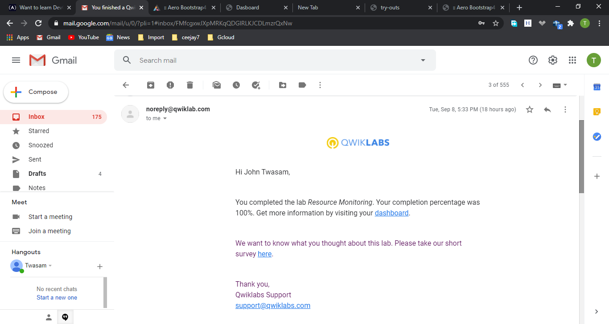
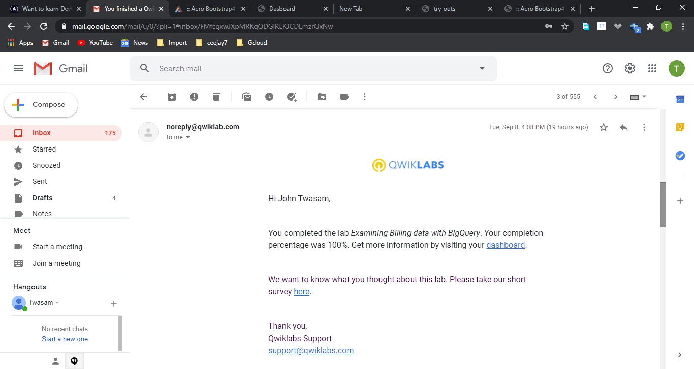

# GADS Practise Project

Screenshots of 13 completed qiucklabs and translated instruction code of 2 labs

## QwikLabs Completed

<details>
  <summary>Lab 1: GCP Fundamentals: Getting Started with Deployment Manager and Cloud Monitoring</summary>
  
</details>

<details>
  <summary>Lab 2: GCP Fundamentals: Getting Started with App Engine</summary>
  
</details>

<details>
  <summary>Lab 3: GCP Fundamentals: Getting Started with Kubernetes Engine</summary>
  
</details>

<details>
  <summary>Lab 4: GCP Fundamentals: Getting Started with Cloud Storage and Cloud SQL</summary>
  
</details>

<details>
  <summary>Lab 5: GCP Fundamentals: Getting Started with Compute Engine</summary>
  
</details>

<details>
  <summary>Lab 6: GCP Fundamentals: Getting Started with Cloud Marketplace</summary>

  
</details>

<details>
  <summary>Lab 7: GCP Fundamentals: Getting Started with BigQuery</summary>

  
</details>
<details>
  <summary>Lab 8: Error Reporting and Debugging</summary>
  
</details>
<details>
  <summary>Lab 9: Resource Monitoring</summary>

  
</details>
<details>
  <summary>Lab 10: Examining Billing data with BigQuery </summary>
  
</details>

<details>
  <summary>Lab 11: Implementing Cloud SQL </summary>
  
</details>

<details>
  <summary>Lab 12: Storage and Database Services </summary>
  
</details>

<details>
  <summary>Lab 13: Cloud IAM</summary>
  
</details>

## Translated code

Creating a VM instance

### Create a virtual machine using the GCP Console

```
<!-- Creating a vitual machine -->

gcloud beta compute instances create my-vm-1 --zone=us-central1-a --machine-type=e2-medium --subnet=default --network-tier=PREMIUM --maintenance-policy=MIGRATE  --tags=http-server --image=debian-9-stretch-v20200910 --image-project=debian-cloud --boot-disk-size=10GB --boot-disk-type=pd-standard --boot-disk-device-name=my-vm-1 --reservation-affinity=any

<!-- Allowing http traffic -->

gcloud compute firewall-rules create default-allow-http --direction=INGRESS --priority=1000 --network=default --action=ALLOW --rules=tcp:80 --source-ranges=0.0.0.0/0 --target-tags=http-server
```

## Translated code

Getting Started with Cloud Storage and Cloud SQL

### Deploy a webserver to a vm instane

```
<!-- Creating the instance -->
gcloud compute instances create bloghost --zone=us-central1-c --machine-type=e2-medium --subnet=default --network-tier=PREMIUM  --tags=http-server --image=debian-9-stretch-v20200910 --image-project=debian-cloud --boot-disk-size=10GB --boot-disk-type=pd-standard --boot-disk-device-name=blog-vm

<!-- Install apache webserver -->
apt-get update
apt-get install apache2 php php-mysql -y
service apache2 restart
```
